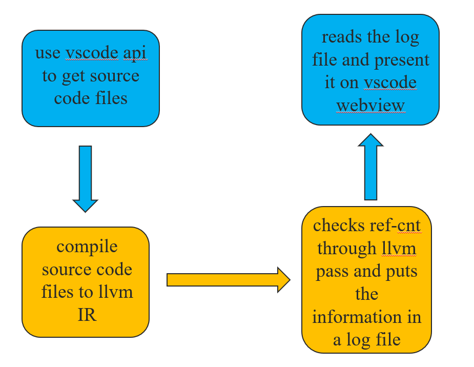
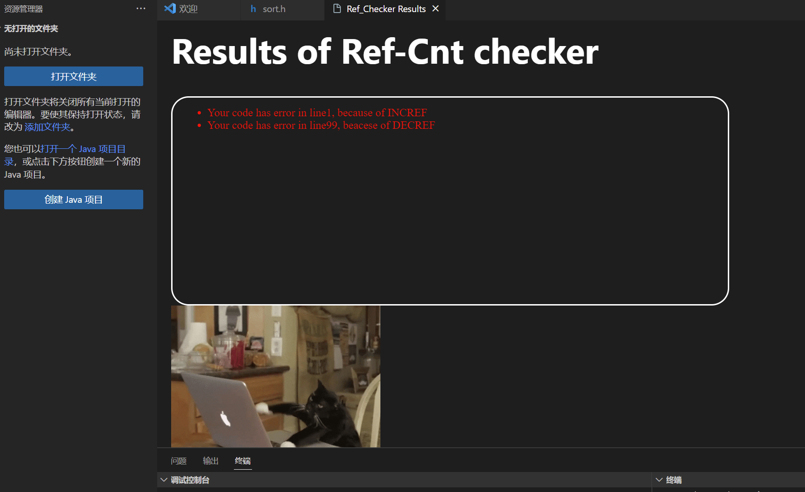

# refcnt-checker-extension

## Project file structure   

```
refcnt-checker-extension
|───assets
|-  |checkform.css //Extending stylesheets files
|-	|...
|───cache //place log information and target code source files
|-	|src.c
|-	|...
|-	|log
|───modules
|-	|... //place function file
|───src
|-	|───test
|-	|checkPanel.ts //report of check result panel
|-	|extension.ts //extension main file
|-	|utils.ts //utils function
|...
```

## Preliminary idea

- use vscode api to get source code files
- The frontend activate backend to use clang to compile source code files to llvm IR
- The backend checks ref-cnt through llvm pass and puts the information in a log file
- The frontend reads the log file and present it on vscode webview
- Below is the flow chart:
- 

## Current front-end progress

finish code frame and can get source files and can present log, also there has a simply webview of vscode(The current style is not indicative of the final product)



